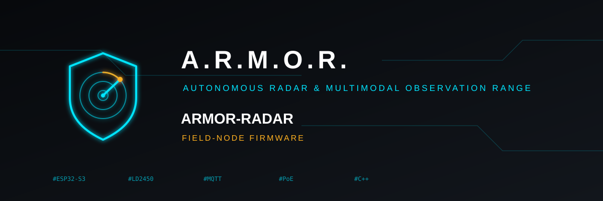

<p align="center">
  
</p>

# 📡 ARMOR-RADAR

<p align="center">
  🇺🇸 <b>English</b> |
  <a href="README_spa.md">🇪🇸 Español</a> |
  <a href="README_fra.md">🇫🇷 Français</a> |
  <a href="README_ita.md">🇮🇹 Italiano</a> |
  <a href="README_deu.md">🇩🇪 Deutsch</a> |
  <a href="README_zho.md">🇨🇳 简体中文</a> |
  <a href="README_jpn.md">🇯🇵 日本語</a>
</p>

### Field-node firmware (Waveshare ESP32-S3-ETH, three radars or presence sensors, Ethernet and Wi-Fi) with its own web panel, and its host-tested core

<p align="center">
  
  
  
  
</p>

---

**Honesty check - what runs today:** **Maturity: scaffolding.** The hardware-independent core (859 checks: the decoders of the LD2450, the LD2461 and four presence sensors, the LD2450 command channel, the settings and their checks, the pin table, users and sessions, the mapped-pin logic, the network plan and the message serialiser, whose output ARMOR-COMMON accepts) is tested on a computer, the **web panel** was exercised in a real browser against a stand-in node, and the **firmware image builds** in the ESP-IDF 5.4.2 container. **It has never run on a board**: no frame has been captured from a real module, the Ethernet, Wi-Fi bridge, light-sensor and update code are untried, the radar command channel is unchecked against the manufacturer's document and against a module, the panel's HTTPS certificate is made by the node itself and untried in a real browser, and the LD2461 and presence-sensor decoders match only the worked examples of their manuals, with no module behind them.

---

## 🎯 Overview

* **Two boards, one firmware:** the Waveshare ESP32-S3-ETH (Ethernet, the default) and an ESP32-S3-WROOM-1 N16R8 with no Ethernet (Wi-Fi only: its set-up asks for the Wi-Fi network to join and it always keeps its own network). The image is chosen when it is built (`tools/build_node.sh generic s3-eth` or `generic s3-wifi`); the pin table and the way in follow the board, the panel hides what the board does not have, and an image is only for its own board. Both build and are host-tested; neither has run on a board.
* **Two nodes of 270 degrees:** each Waveshare ESP32-S3-ETH reads up to three LD2450 radars on its three UARTs, mounted 75 degrees apart, over wired Ethernet (W5500) with DHCP or a fixed address, powered by PoE or USB. Studio's *Add a 270° node* creates the three radars already wired to the node.
* **A web panel on every node,** in the look of Studio and its seven languages, embedded in the firmware: overview, network, Wi-Fi, broker, radars, pins, users, firmware update and log. A node with no user opens the Wi-Fi `ARMOR-SETUP-xxxxxx` and creates its first administrator with a set-up code; passwords are salted PBKDF2, sessions are random tokens, and every setting lives in the node's flash, so one image serves every node and no password is compiled in ([the panel](docs/NODE_PANEL.md)).
* **One Wi-Fi from many nodes:** each node can offer an access point joined to its Ethernet port; give the nodes the same name and password and the channel on automatic (1, 6 or 11 by MAC) and phones and Wi-Fi sensors see one network with one DHCP server. It is not a radio mesh: every node keeps its cable. A node can instead join a router's Wi-Fi (with a search for networks), and one with no cable can be configured over **Bluetooth** from the Android app.
* **Pins for the server:** any free pin becomes an input, an output (with a safe state when the broker is lost), PWM or an analogue reading, and appears as a device of the server, so a relay or a contact needs no new firmware. The board's reserved pins are never offered.
* **Over-the-air updates with rollback** from the panel (two slots on the 16 MB flash), and a **link from Studio** to each node's panel, from the address the node publishes.
* **The panel over HTTPS:** the node makes its own certificate (self-signed, kept in flash) and serves the panel on port 443 as well as 80, or only on 443; the session cookie is marked Secure and the certificate fingerprint is shown to compare with the browser's warning. **Stable track identities:** each frame's targets are matched to the ones followed before, so a person keeps the same track id, a lost frame does not flicker and positions are smoothed a little.
* **Six sensor models, one per port:** a port carries an LD2450 or an LD2461 (trackers that feed the perimeter, with the model's own field in Studio) or a presence sensor (LD2410, LD2412, LD2410S, MR24HPC1) that becomes a device of the server and publishes presence and distance. Chosen in the panel; what each one is, its protocol and what was not verified are in `docs/SENSORS.md`.
* **LD2450 decoder, health and configuration:** a resynchronising framer finds frames in a noisy stream; each 30-byte frame gives up to three targets that become contract tracks; the console and the panel say per radar whether it reports, is silent or garbled. The panel can also read the module's version, choose one or three targets and set detection zones (a protocol that is unchecked against a module).
* **Ambient light and contract-exact messages:** the VEML7700 with automatic range; telemetry, health and information JSON that follow the published schemas and refuse to write anything invalid, with wall-clock timestamps (SNTP) and an MQTT last will. Telemetry is withheld while no radar reports, never an empty 'all clear'.
* **One image for every board, like a network product:** the firmware is the same and the MAC tells the boards apart (`armor-` and six digits until named); `adopt_node.py` gives a freshly flashed node its administrator, its broker identity and the fleet's shared settings over the network, with a set-up code computed from its MAC, so 5 nodes or 27 are the same work. **Bench tools:** flashing over USB-C, a stand-in node for working on the panel, and a converter from a log of raw frames to a test fixture ([bench bring-up](docs/BENCH_BRINGUP.md)).

## 📂 Repository Structure

```text
ARMOR-RADAR/
├── main/
│   ├── app_main.cpp        start-up: settings, radars, pins, network, panel, broker
│   ├── node_store.cpp      settings and users in flash
│   ├── network.cpp         Ethernet, Wi-Fi access point and bridge, station
│   ├── web_server.cpp      the panel and its JSON API, login, update
│   ├── radar_manager.cpp   UARTs, frames, health, command channel
│   ├── gpio_manager.cpp    the pins mapped for the server
│   ├── mqtt_link.cpp       clock, health, telemetry, information, pin topics
│   ├── board_ethernet.cpp, light_sensor.cpp, log_buffer.cpp, entropy.cpp
│   ├── Kconfig.projbuild   the first settings of a build
│   └── core/               framer, ld2450, ld2450_command, node_config, board_pins, network_plan, auth, gpio_logic, json, veml7700, telemetry_json...
├── panel/                  index.html, app.js, text.js (7 languages), style.css
├── tests/                  test_core.cpp, test_node.cpp, emit_samples.cpp, check_contract.py, test_tools.py
├── tools/                  build_node.sh, make_fleet.py, adopt_node.py, provision_node.sh, flash.bat, pack_panel.py, panel_mock.mjs, frames_to_fixture.py
├── secrets/                node.conf.example, fleet.example.json (the real files are git-ignored)
├── partitions.csv, sdkconfig.defaults
└── docs/                   BENCH_BRINGUP.md, NODE_PANEL.md, HARDWARE_BOUNDARY.md
```

## 🛠️ Development Environment

```bash
cmake -S tests -B build/host && cmake --build build/host
build/host/test_core && build/host/test_node && build/host/test_sensors && build/host/test_board_wifi   # 859 checks, -Werror
build/host/emit_samples | python tests/check_contract.py
node tools/panel_mock.mjs --user admin:adminpass123   # the panel without a board
python tools/make_fleet.py                             # once: the fleet secret and the shared settings
tools/build_node.sh generic                           # ONE image for every Waveshare board (dist/generic-s3-eth.bin), in the ESP-IDF container
tools/build_node.sh generic s3-wifi                   # the same firmware for an ESP32-S3-WROOM-1 N16R8 with no Ethernet
```

```bat
tools\flash.bat generic COM5 monitor                  # each Waveshare board, once, by USB-C (add s3-wifi for the other board)
```

```bash
tools/adopt_node.py 192.168.0.181 --id perimetro-3 --fleet secrets/fleet.json --broker-ssh-host <cm5> --broker-ssh-user <user>
```

The host tests need any C++17 compiler (Linux, WSL, MSYS2). See the [bench bring-up](docs/BENCH_BRINGUP.md), the [panel](docs/NODE_PANEL.md) and the [hardware boundary](docs/HARDWARE_BOUNDARY.md).

## 🔗 Related Projects

**A.R.M.O.R.** (Autonomous Radar & Multimodal Observation Range) is a perimeter-security system made of independent repositories. Each one has its own version, its own tests and its own README; this is the family:

* **[ARMOR-COMMON](../ARMOR-COMMON)** - Message contracts, validators, conformance vectors and generated types
* **ARMOR-RADAR** (this repository) - Field-node firmware for ESP32-S3 with three radars and its own web panel
* **[ARMOR-SOLAR](../ARMOR-SOLAR)** - Solar inverter and battery protocols and the messages of a gateway node
* **[ARMOR-SERVER](../ARMOR-SERVER)** - Central coordinator: telemetry, alarms, devices, solar readings and cameras
* **[ARMOR-STUDIO](../ARMOR-STUDIO)** - Web console: cameras, radar, alarms, solar energy and the 2D/3D site designer
* **[ARMOR-ANDROID-CONTROL](../ARMOR-ANDROID-CONTROL)** - Android operator client with a live 2D/3D radar
* **[ARMOR-SERVER-AI](../ARMOR-SERVER-AI)** - Visual inference policy that explains its decisions and never actuates
* **[ARMOR-VOICE-AI](../ARMOR-VOICE-AI)** - Offline voice intents with a confirmation that cannot be forged
* **[ARMOR-HARDWARE](../ARMOR-HARDWARE)** - Enclosures, electronics and the bench acceptance matrix
* **[ARMOR-DEVOPS](../ARMOR-DEVOPS)** - Deployment, the CM5 test bench, backup and TLS
* **[ARMOR-SIMULATOR](../ARMOR-SIMULATOR)** - Offline telemetry simulator with repeatable faults
* **[ARMOR-DOCS](../ARMOR-DOCS)** - Architecture, security baseline and the capability matrix

## 📚 Documentation & Community

Where to read more:

* [Capability matrix: what is proven and what is not](../ARMOR-DOCS/docs/CAPABILITY_MATRIX.md)
* [Project catalogue: versions and how the repositories depend on each other](../ARMOR-DOCS/docs/PROJECT_CATALOG.md)
* [Changelog of this repository](CHANGELOG.md)
* [License (GPL-3.0-or-later)](LICENSE)
* Questions, ideas and reports: electrohobby3d@gmail.com

## 👤 AUTHOR

**JuanenRac (Electro Hobby 3D)** · electrohobby3d@gmail.com

## 📜 LICENSE

GPL-3.0-or-later - see [LICENSE](LICENSE).
